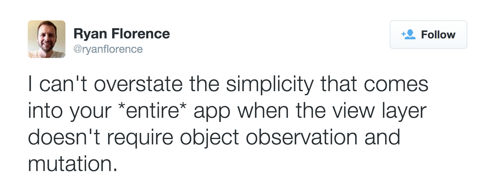

React
=====

A JavaScript Library For Building User Interfaces
-------------------------------------------------


---

React is not FRP
================

> [Functional] Reactive programming is programming with asynchronous data streams.

-- André Staltz[^1]

[^1]: [The introduction to Reactive Programming you've been missing][]

[The introduction to Reactive Programming you've been missing]: https://gist.github.com/staltz/868e7e9bc2a7b8c1f754

---


Component Based
---------------

It's components all the way down!


---

Functional - Declarative UI
---------------------------

Imperative <-> Declarative


---

Functional - Declarative UI
---------------------------



---


Virtual DOM
-----------

The UI is first rendered to a virtual DOM, then a minimal and efficient diff is applied to the actual DOM to update the visible UI.


---

(aside) JSX Syntax
------------------

``` js
// JSX as authored
<div className="app">
  <h2>Hello World</h2>
  <p>Welcome to {this.props.appName}</p>
</div>
```

``` js
// output JS
React.createElement("div", {className: "app"},
  React.createElement("h2", null, "Hello World"),
  React.createElement("p", null, "Welcome to ", this.props.appName)
)
```

---

Sample App
----------


---

Sample App
==========

- App component (blue)


---

Sample App
==========

- App component (blue)
- User list component (green)


---

Sample App
==========

- App component -- blue
- User list component -- green
- Profile component(s) -- red


---

User profile component
----------------------

``` js
var Profile = React.createClass({
  githubUrl: function() {
    return "https://github.com/" + this.props.user.github;
  },

  render: function() {
    return (
      <li className="user">
        <a href={this.githubUrl()}>
          {this.props.user.name} on github
        </a>
      </li>
    )
  }
});
```

---

User List Component
-------------------

``` js
var UserList = React.createClass({
  renderUser: function(user) {
    return <Profile user={user} />
  },

  render: function() {
    return (
      <ul>
        {this.props.users.map(this.renderUser)}
      </ul>
    )
  }
})
```

---

App Component
-------------

``` js
var App = React.createClass({
  render: function() {
    return (
      <div className="app">
        <h1>Active Users</h1>
        <p>{this.props.users.length} active users</p>
        <UserList users={this.state.users} />
      </div>
    )
  }
})
```

---

Boot The App
------------

``` js
var users = [
  { name: "Chris", github: "christoomey" },
  { name: "Joe", github: "jferris" },
  { name: "Ben", github: "r00k" },
  { name: "Chad", github: "cpytel" }
];

React.renderComponent(
  <App users={users} />,
  document.getElementById('content')
);
```

---

Rethinking Best Practices
-------------------------

- **Render the world** - Re-render everything on any change Re-render the entire app (in memory) on all changes, then efficiently update the UI to match.
- **Seperation of Concerns** - Rather than pulling out templates, separate in terms of components
- **Hide the DOM** - The Virutal DOM abstracts away the harsh reality of the DOM API and allows you to focus on your app.

[From Pete Hunt's presentation][]

[From Pete Hunt's presentation]: http://www.slideshare.net/floydophone/react-preso-v2

---

The right abstraction
=====================

Abstracting away the DOM has lead to some very impressive work in short time

- [canvas render target][]
- [Netflix's gibbon widget system][]
- [Server side / isometric rendering][] -
- [react native][]

[canvas render target]: http://engineering.flipboard.com/2015/02/mobile-web/
[Netflix's gibbon widget system]: http://conf.reactjs.com/schedule.html#beyond-the-dom-how-netflix-plans-to-enhance-your-television-experience
[react native]: https://facebook.github.io/react-native/
[Server side / isometric rendering]: https://github.com/mhart/react-server-example
[Glimmer]: https://github.com/emberjs/ember.js/pull/10501

---

Flipboard's Canvas
------------------


In search of 60fps on mobile.

React Canvas adds the ability for React components to render to `<canvas>` rather than DOM.

---

Netflix Gibbon
--------------

Netflix's Gibbon widget system is an alternative rendering engine that takes the place of the DOM, while still using React.


---

Server Side
---------------------------------------------

Since the DOM is abstracted away, react can run in Node and render to a string!


---

React Native
---------------------


---

The Right Abstraction
=====================

> It's worth noting that we're not chasing “write once, run anywhere.” Different platforms have different looks, feels, and capabilities, and as such, we should still be developing discrete apps for each platform, but the same set of engineers should be able to build applications for whatever platform they choose, without needing to learn a fundamentally different set of technologies for each. We call this approach “learn once, write anywhere.”

-- Tom Occhino (React team at Facebook)[^2]

[^2]: https://facebook.github.io/react/blog/2015/03/26/introducing-react-native.html

---

Learning More
-------------

- [Official React tutorial from Facebook][]
- [Ryan Florence's React training repo][]
- [Presentation by Ember core team member on React][]
- [React-rails gem][]

---

[Official React tutorial from Facebook]: http://facebook.github.io/react/docs/tutorial.html
[Presentation by Ember core team member on React]: https://docs.google.com/presentation/d/1afMLTCpRxhJpurQ97VBHCZkLbR1TEsRnd3yyxuSQ5YY/preview?slide=id.p
[React-rails gem]: https://github.com/reactjs/react-rails
[Ryan Florence's React training repo]: https://github.com/ryanflorence/react-training
